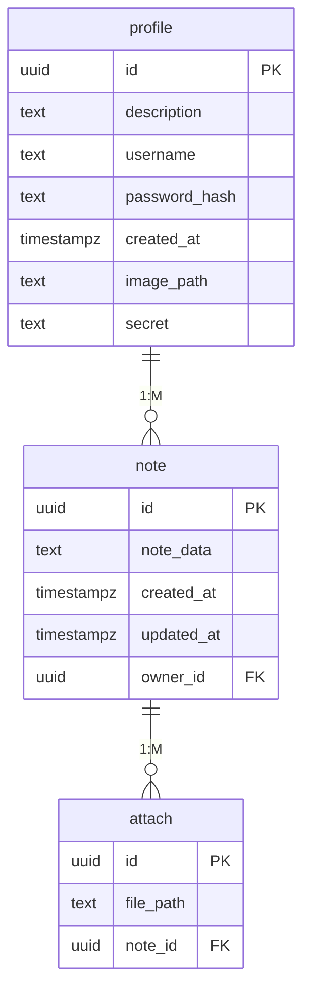

# Структура базы данных

## Схема данных

## Описание таблиц
### profile
Таблица profile содержит данные пользователей:
- id - идентификатор пользователя
- description - описание в профиле пользователя
- username - логин пользователя, а также его имя в сервисе
- password_hash - хэш пароля пользователя
- created_at - дата и время регистрации (с таймзоной)
- image_path - путь до файла аватарки пользователя
- secret - секрет для генерации QR-кода для двухфакторной аутентификации

### note
Таблица note отвечает за хранение заметок:
- id - идентификатор заметки
- data - содержимое заметки
- created_at - дата и время создания заметки (с таймзоной)
- updated_at - дата и время последнего изменения заметки (с таймзоной)
- owner_id - идентификатор пользователя, который является создателем заметки

### attach
В таблице attach хранятся сведения о вложениях заметок:
- id - идентификатор вложения
- path - путь до файла на сервер
- note_id - идентификатор заметки, к которой это вложение прикреплено

## Нормализация
### Функциональные зависимости:
**profile:**
- {id} -> description, username, password_hash, created_at, image_path, secret
- {username} -> id, description, password_hash, created_at, image_path, secret

**note:**
- {id} -> data, created_at, updated_at, owner_id

**attach:**
- {id} -> path, note_id
- {path} -> id, note_id

### Проверка нормальных форм:
- **Первая нормальная форма (1NF):**
В схеме каждый атрибут является атомарным, так что она соответствует 1NF. 

- **Вторая нормальная форма (2NF):**
В схеме каждый неключевой атрибут зависит от всего первичного ключа, поэтому она соответствует 2NF. 

- **Третья нормальная форма (3NF):**
В схеме нет транзитивных зависимостей, так как каждый атрибут функционально зависит только от ключа и не от других атрибутов. 

- **Нормальная форма Бойса-Кодда (BCNF)**:
В схеме все функциональные зависимости либо тривиальны, либо ключевые, поэтому она соответствует BCNF. 
