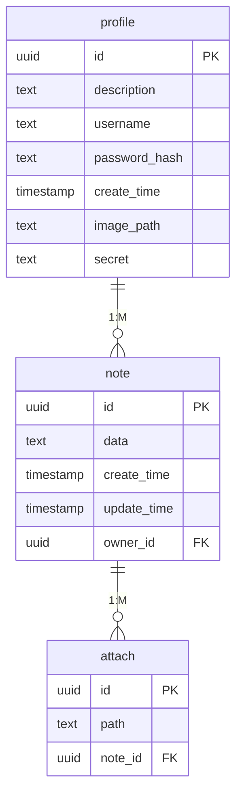

# Структура базы данных

## Схема данных

## Описание таблиц
### profile
Таблица profile содержит данные пользователей: 
id - идентификатор пользователя 
description - описание в профиле пользователя 
username - логин пользователя, а также его имя в сервисе 
password_hash - хэш пароля пользователя 
create_time - дата и время регистрации 
image_path - путь до файла аватарки пользователя 
secret - секрет для генерации QR-кода для двухфакторной аутентификации 

### note
Таблица note отвечает за хранение заметок: 
id - идентификатор заметки 
data - содержимое заметки 
create_time - дата и время создания заметки 
update_time - дата и время последнего изменения заметки 
owner_id - идентификатор пользователя, который является создателем заметки 

### attach
В таблице attach хранятся сведения о вложениях заметок: 
id - идентификатор вложения 
path - путь до файла на сервере 
note_id - идентификатор заметки, к которой это вложение прикреплено 

## Нормализация
### Функциональные зависимости:
profile: 
{id} -> description, username, password_hash, create_time, image_path, secret 
{username} -> id, description, password_hash, create_time, image_path, secret 
{password_hash} -> id, description, username, create_time, image_path, secret 
{create_time} -> id, description, username, password_hash, image_path, secret 
{image_path} -> id, description, username, password_hash, create_time, secret 
{secret} -> id, description, username, password_hash, create_time, image_path 

note: 
{id} -> data, create_time, update_time, owner_id 
{owner_id} -> id, data, create_time, update_time 
{create_time} -> id, data, update_time, owner_id 
{update_time} -> id, data, create_time, owner_id 

attach:
{id} -> path, note_id 
{note_id} -> id, path 

### Проверка нормальных форм:
Первая нормальная форма (1NF): 
В схеме каждый атрибут является атомарным, так что она соответствует 1NF. 

Вторая нормальная форма (2NF): 
В схеме каждый неключевой атрибут зависит от всего первичного ключа, поэтому она соответствует 2NF. 

Третья нормальная форма (3NF): 
В схеме нет транзитивных зависимостей, так как каждый атрибут функционально зависит только от ключа и не от других атрибутов. 

Нормальная форма Бойса-Кодда (BCNF): 
В схеме все функциональные зависимости либо тривиальны, либо ключевые, поэтому она соответствует BCNF. 
