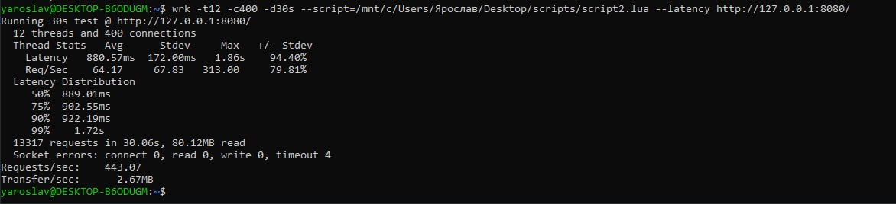

# Нагрузочное тестирование

Нагрузочное тестирование проводилось на выделенной виртуалке.

## Создание заметок
wrk -t4 -c100 -d60s --script=script.lua --latency http://127.0.0.1:8080/

Видно, что мощности виртуалки хватило на 150rps при запущенном приложении.

## Чтение заметок
wrk -t4 -c100 -d60s --script=script2.lua --latency http://127.0.0.1:8080/

Видим около 570rps.
